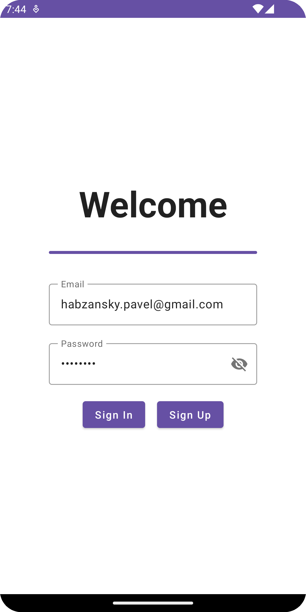
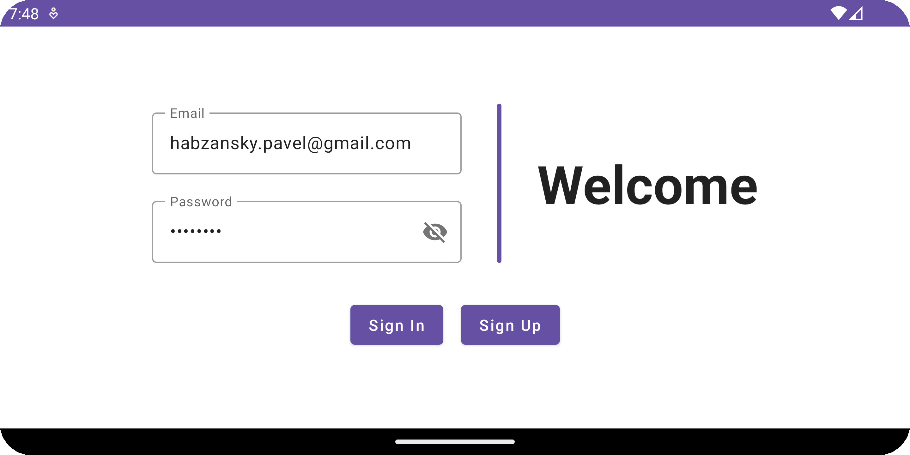
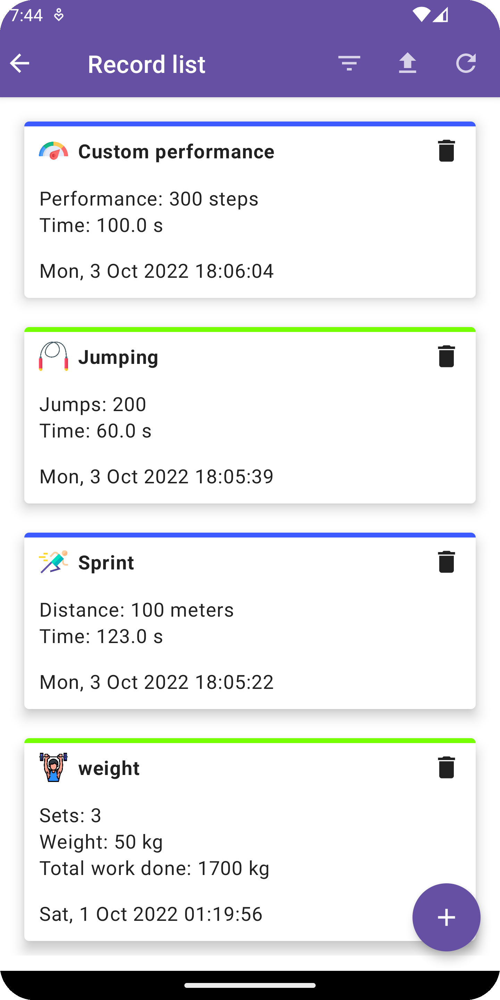
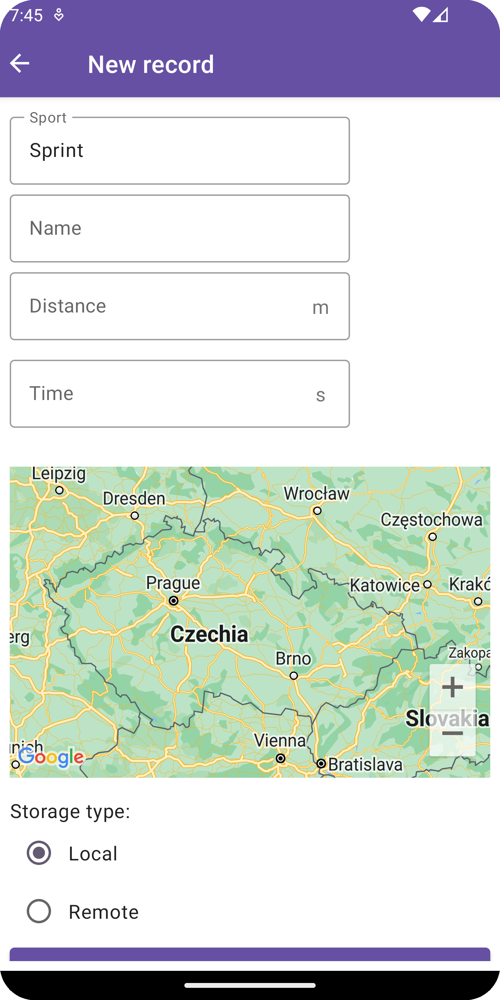
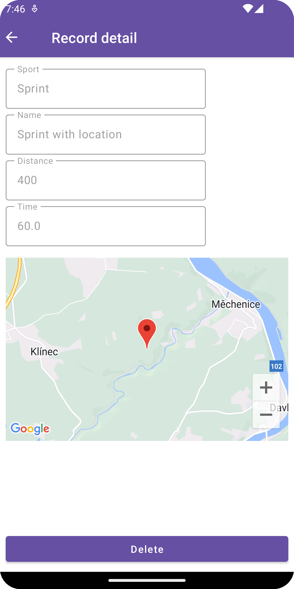

# SportsRec App
This is just a sample application used as a show case of my technical prowess.
SportsRec is used to store, edit and post sport performace records.

This README also contains my thoughts on different possible approaches and implementations of different features in this app.

## Overview
SportsRec uses standard MVVM architecture and `Clean Architecture` code structure, mainly separation of concerns, code base is divided into three different modules:

- `app` - module concerned with app configuration and views, it has access to both domain and data modules
- `domain` - module concerned with business logic, this module should always be independent of platform (no access to things like Context, ViewModel, etc), it also provides interfaces for data module
- `data` - module concerned with data storage and remote communication, it has access to domain module

There are multiple other approaches that could have been used (MVI is getting traction in recent months). Notably we could have separated app module into two different modules - app module for application configuration and Application itself and presentation for screens and ViewModels, that way, we could better separate module concerned with views from data module.

It would often make sense to use feature based approach - different feature modules in root of the project and presentation/domain/data layers in each feature module - but this sample app doesn't contain that many features for this approach to make sense.

Navigation is handled through `Compose Navigation`. Navigation events are merged together with `Snackbars` into instances of `UiEvent` to make their handling more streamlined. Each `ViewModel` has `UiEvent` flow that can be observed from screens through `collect()`. UI actions such as field inputs and button clicks are handled through `ViewModel` by calling `onEvent()` functions, `ViewModel` modifies data accordingly and screen is then automatically recomposed.

Project dependencies are managed through `buildSrc` module.

Project uses `Firebase Crashlytics` for crash reporting.

Logging is implemented through `Timber` library, all logs are written into `log.txt` file.

## App module
App module contains app configuration, `Hilt` modules, screens and view models for different features.

Screens are implemented using `Jetpack Compose`.

## Domain module
Domain module contains business logic of the app and general functions and extensions. It also exposes interfaces for repositories and services that different modules can implement. Domain module should also be independent of platform (Android, iOS or anything else) so that this business logic can be used in multiplatform development.

## Data module
Data module contains data storage and remote communication logic. Local storage is implemented using `Room` SQLite database, remote communication uses `Retrofit` client.

Data module also contains authentication logic using FirebaseAuth. User is authenticated using his email and password.

Sports records are often represented as instances of sealed classes, including data transfer objects (DTOs), to solve problem of de/serialization into polymorphic objects I used `PolymorphicJsonAdapterFactory` from `Moshi` library. That way we can bind different JSON objects to children of `PerformanceRecordDto` class through their `type` attribute.

Example of data used in `REST` communication:
```
{
  "8Vz8MGOsPCMef7fyQMulBtJhS672": {
    "records": {
      "6bb6c998-bdc5-4202-bd68-15e1bcc0a328": {
        "createTime": 1664813139438,
        "key": "6bb6c998-bdc5-4202-bd68-15e1bcc0a328",
        "name": "Jumping",
        "performanceRecord": {
          "jumps": 200,
          "time": 60,
          "type": "ROPE_JUMP"
        }
      }
    }
  }
}
```
Root hash element is equal to `uid` generated by `FirebaseAuth`, hash element under `records` node is unique `UUID` of record itself.

## Authentication
For the app to be useful I added authentication through `FirebaseAuth`, user is authenticated using his email and password. There is no separate screen for sign up, user is either signed in or signed up depending on which button he clicked and inputs. If there's an error, `Snackbar` message pops up. The authentication state is held only through Firebase SDK.

## Records list
List of sports records is by default sorted by date added (newest to oldest). Using action in `TopAppBar` user can filter records by their storage type (`LOCAL` vs `REMOTE`), upload local data to remote storage and download remote data to local storage. If user uses SportsRec app from different devices there might be a different between their data sets, upload/download functions exist to solve this problem.

Each record contains name, date of creation and record information (time, distance, weight, etc.). Records are distinguished by their storage type by color of top bar (green for remotely stored records, blue for locals) and by sport type:
- Weightlifting --> Dumbbell
- Sprint --> Running stickman
- Rope jumping --> Jumping rope
- Custom --> Speedometer

Custom sport type serves for anything that might not fit into above three types.

User can also delete records from this screen.

## New record
Record detail screen is composed of dropdown for different sport types. The rest of form is composed based on one of selected types which are represented as `MutableState` instances of `NewRecord` sealed class.
After type selection user can fill in record data and his position using `GoogleMap`.

When opening `NewRecordScreen` user is asked for location permission, if it's given, map is automatically showing his position. If user doesn't give his permission, map is initialized in default state.

In bottom of the screen user can select storage in which they want to store this record (local selected by default).
Based on his selection record is either sent to `Firebase` database via `Retrofit` client and saved in `Room` database or only in local database.

## Record detail
Record detail is a static screen listing information about given record. Record's location is shown on `GoogleMap` if it exists (location is not mandatory). User can also delete this record from this screen.

## Screens
### Auth screen


### List screen

### New record screen

### Record detail screen


## Conclusion
We managed to build a simple application for recording sport performance in different sport types. Application is based on `Clean Architecture` principles and uses `MVVM` pattern.

### Possible improvements
- Unit tests
- UI design
- Improvement of `TopAppBar` - currently each screen has its own `TopAppBar`, this has undesired effect of `TopAppBar` briefly flashing when navigating between screens
- Migrate `.gradle` files to `Kotlin DSL`
- More strict separation of modules - `app` into `app` and `presentation`, add `infrastructure` module, separate `remote` and `local` data work into different modules
- Make `ViewModels` more abstract with some kind of `ScreenState` or `ScreenEvent` as generic types
- Better logging